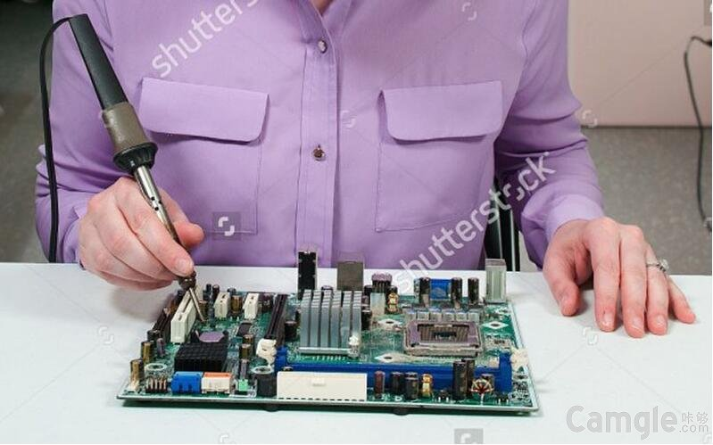

# AMA - Ask me anything! 

> 根据Coding发起的活动（[https://coding.net/u/phodal/p/AMA/git](https://coding.net/u/phodal/p/AMA/git)）而Fork的~~。

照例先上简介：

黄峰达（ID: Phodal），毕业于一所你可能从来没听过的二流大学——西安文理学院的电子信息工程专业（电铬铁专业），现就职于ThoughtWorks（深圳）。

长期活跃于某IT届大型同性交友平台Gayhub且编写有相当数量的物联网相关开源软件，同时在维护物联网相关资料。

曾作为技术专家审阅英文版Packt出版社的物联网书籍《Learning Internet of Things》，并用四级没通过的英语翻译了该书。现长期担任InfoQ《物联网周报》社区编辑，也曾混了个CSDN前端博客专家的名声。

还因为拥有多个Star上千的电子书项目成了所谓的Markdown程序员。这些电子书包括：《一个全栈增长工程师的练手项目集》、《全栈增长工程师实战》、《全栈增长工程师指南》、《一步步搭建物联网系统》等。

一开始我只是一个前端工程师，静静地做个写写HTML + CSS的美男子。

写写Backbone、React、Angular，顺便写写移动应用。

因为工作的缘故，开始写一些后台代码——Java、Ruby、Scala。也因此对搜索引擎和WebGIS（网络地理信息系统）有更深入的研究。

就是这样一枚长年依靠“全栈”活跃在各大平台的全沾工程师，如你所见，玩硬件，也玩前端。

没错，我只是随便的一写，所以你有什么想问的吗？

个人网站：https://www.phodal.com/ 

允许问我任何问题：个人，工作，生活，代码，或其他任何事情。

提问准则：

 - 问题以评论方式呈现，重复问题以先提问的为准。
 - 使用尽量简洁的描述。
 - Bug 和功能反馈请发到相应的项目讨论里

八卦及情感问题请咨询我们家花仲马——无论是程序员的情感困惑，还是我的独家秘事，以及你所好奇的我们之间的任何问题——某人说了，只要你敢问她就敢答：

License
---

MIT
